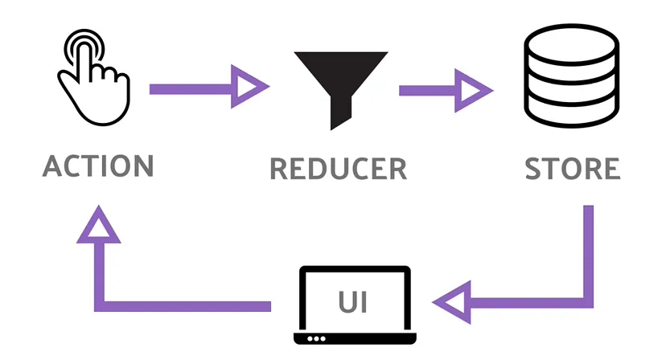
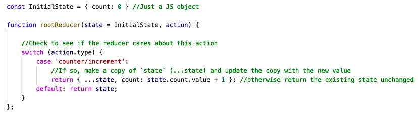

# Redux Example Project

This project is a simple example of how to use Redux in a React project.
It is a simple counter that can be incremented or decremented.

To start this project run the following commands:

```npm install ```

```npm run dev```


## There are two branches in this project:

- basic-redux: This branch contains the basic implementation of Redux in a React project.
- Advanced-redux: This branch contains a more advanced implementation of Redux in a React project.


#### Before getting into anything you need to have this very basic understanding of the three basic concepts in redux.

- Actions
- Reducer
- Store

A basic understanding of the redux framework can be scraped off this diagram below:



A component dispatches an action into the reducer. The reducer then knows what to do with that action and updates the values in the store accordingly.

We’ll take a CRUD approach to hello world to give you a basic understanding of how Redux works. Based on the diagram above the symbols shows exactly the meaning of what everything does. Like reducers are used as a filter. Action is click, press, etc actions upon which you dispatch an action to the reducer. The reducer then filters out the data and updates the value in store from where our UI read and updates.

Let’s quickly go through the main terms. Encourage you to read this theory if you have been avoiding it.

ACTION: An action is a plain javascript object. An action contains two things, the type field should be a string that gives this action a descriptive name like "INCREMENT". We usually write that type string like "domain/eventName". Next, we need payload field that can be anything i.e. int, string, object, nested objects, arrays, etc.
(Don’t worry if you don’t know how to do it, we’ll go to the syntax shortly.) A typical action object looks like this:

```const addTodoAction = {
type: 'INCREMENT',
payload: "10"
}
```
Action Creators — Since we’re talking about actions, it’s worth mentioning that we make functions that create and returns the action object.
These functions are called action creators and it looks something like this:

```function addTodo(text) {
return {
type: 'INCREMENT',
payload: text
}
}
```
So, this is basically what actions will look like, and up to this point, we’ve only written vanilla JS.

REDUCER: A reducer is a function that receives two things:

- current state
- action object

You can think of a reducer as an event listener which handles events based on the received action (event) type. Inside a reducer function, this is what goes:

See if the reducer cares about the provided action? If yes, then make a copy of the state, update the copy with new values and return the updated state. If not, then return the existing state unchanged.

Confused? Here is an example that exactly interprets the above text to code:


STORE: Store is the database where the state of your entire application exists. It has some built-in functions like getState() that is used to return the current state value. A store takes in a reducer as a parameter. Another important method that the store has is dispatch().

Dispatch —The only way to update the state in the store is to call store.dispatch() and pass it an action object, for example:

```
store.dispatch({ type: 'counter/increment' })
```
```
console.log(store.getState()) //{count: 1}
```
You can think of dispatch as “triggering an event” like pressing a button, or an API call is finished, etc.

Something happened, we wat the store to know about it, we dispatch an action. A reducer act as an event listener basically, and when they hear an action they are interested in, they update the state in response. A small example would be:
```
const increment = () => {
return {
type: 'INCREMENT'
}
}
store.dispatch(incremet())
console.log(store.getState()); //{value: 2}

```
So, you should now have the basic idea of what action, action creator, reducer, store, getState, and dispatch is.

## Action

In action we have two actions that are increment and decrement. The action will be dispatched when the button will be clicked.

[Action.js](src/actions/Actions.js)


## Reducer

The below contains the reducer that will work when an action will be dispatched and the reducer will then make the change and return us the updated initial state.

[IncrementDecrementReducer.js](src/reducers/IncrementDecrementReducer.js)


## Wrapping the Provider Around App component

We’ll be needing these three items to wrap our application around redux.

- Provider — A Provider is a component that makes the store available to any nested components that need to access the store.
- Store — The store is where the state of your application is stored.

In Main.js we’ll wrap our App Component with Provider with store as prop

[Main.jsx](src/Main.jsx)


## App.jsx

In App.jsx we have defined the UI of the application. We have two buttons that will dispatch the action when clicked.

also the current state is being fetched using useSelector .

[App.jsx](src/App.jsx)

Since react-redux is a package specifically to handle react related behaviors with redux so we have two methods i.e. useSelector, useDispatch

useSelector(selector: function, equalityFn: function) — Allows you to extract data from the Redux store state. A selector will subscribe to the Redux store and run our selector whenever an action is dispatched.

useDispatch() — Allows you to dispatch an action to the store by simply adding an action object as an argument to the new variable. This hook returns a reference to the dispatch function from the Redux store. You may use it to dispatch actions as needed.

